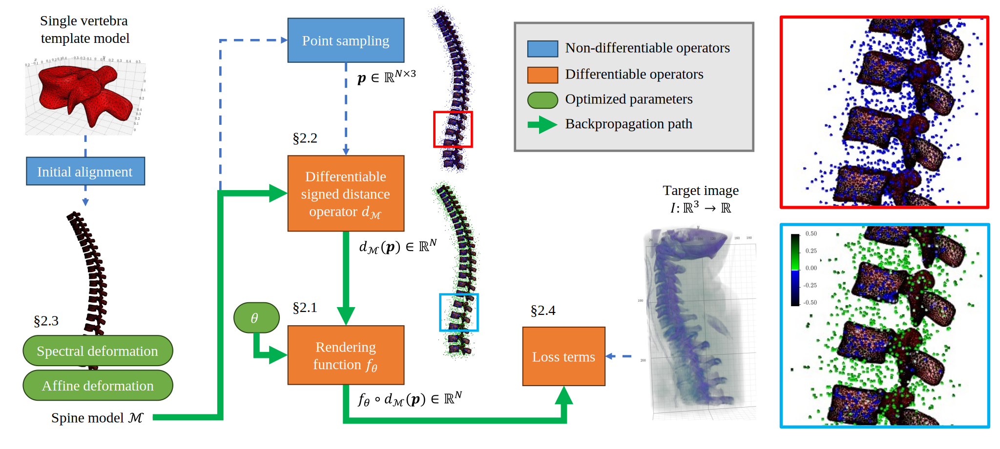

DiffAM: Differentiable Appearance Modeling
===
[[Preprint](https://sstdv-project.github.io/DiffAM/static/pdfs/manuscript.pdf)]
[[Project Page](https://sstdv-project.github.io/DiffAM/)]
[[SPIE MI 2024 Homepage](https://spie.org/medical-imaging/presentation/Vertebral-segmentation-without-training-using-differentiable-appearance-modeling-of-a/12926-93)]

Official source code for SPIE Medical Image 2024 paper "Vertebral segmentation without training using differentiable appearance modeling of a deformable spine template."



## How to run
```bash
### Clone the repository
$ mkdir diff-am
$ git clone https://github.com/SSTDV-Project/DiffAM.git .
$ cd diff-am

### Install & activate environment
$ conda env create -f environment.yml
$ conda activate diff-am

### Run examples
$ cd examples
$ python test-sphere.py
```

## Tested environment
* OS: Ubuntu 20.04
* GPU: NVIDIA GeForce RTX 3090
* GPU Driver: 535.129.03
* Host CUDA version: 12.2

## Citation

TBA

## Acknowledgement

> This work was supported by Institute for Information & communications Technology Promotion(IITP) grant funded by the Korea government(MSIT) (No.00223446, Development of object-oriented synthetic data generation and evaluation methods)
